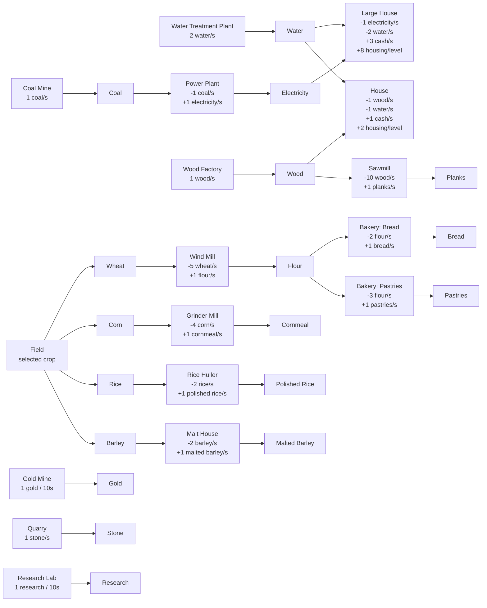
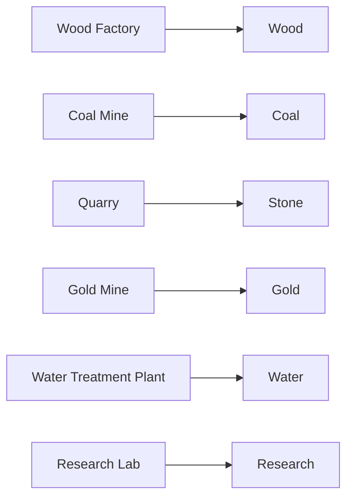
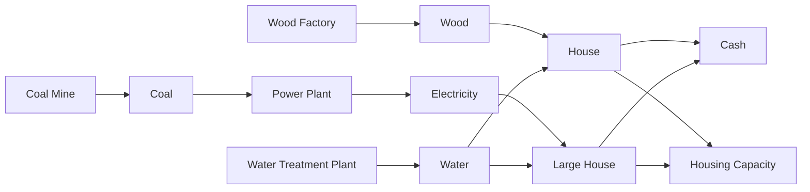
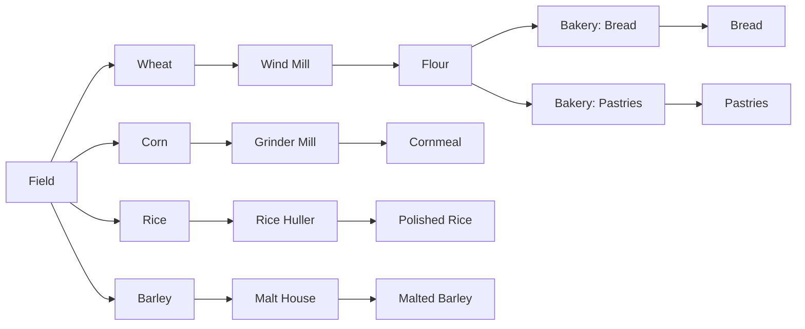

# Production Chains

This document describes the current production chains and the buildings that
participate in them.

## Source Of Truth

Production-chain data comes from `BuildingRegistry.availableBuildings` in
`lib/game/building/building.dart`.

Each placed `Building` contributes:

- `generation`: resources produced per second, scaled by building level.
- `consumption`: resources consumed per second, scaled by building level.
- `requiredWorkers`: worker count required for production.
- `category`: graph grouping used by the production overlay.

`Field` and `Bakery` have dynamic recipes:

- `Field.cropType` selects wheat, corn, rice, or barley.
- `Bakery.productType` selects bread or pastries.

## Production Rules

The live resource tick uses the current placed buildings:

1. Buildings without consumption produce when they have enough assigned workers.
2. Buildings with consumption produce only when all input resources are
   available and the building has enough assigned workers.
3. Buildings with `requiredWorkers == 0`, such as housing, satisfy the worker
   requirement automatically.
4. Inputs are consumed before outputs are generated.
5. Research generation is accumulated and paid out every 10 seconds.

## Full Chain Diagram

## Chain Groups

### Basic Resource Producers

| Building | Inputs | Outputs | Workers | Category | Research Gate |
| --- | --- | --- | --- | --- | --- |
| Wood Factory | None | 1 wood/s | 1 | rawMaterials | None |
| Coal Mine | None | 1 coal/s | 1 | rawMaterials | None |
| Quarry | None | 1 stone/s | 1 | rawMaterials | None |
| Gold Mine | None | 0.1 gold/s | 1 | rawMaterials | Gold Mining |
| Water Treatment Plant | None | 2 water/s | 1 | foodResources | None |
| Research Lab | None | 0.1 research/s | 1 | services | None |

### Energy And Housing

| Building | Inputs | Outputs | Workers | Category | Research Gate |
| --- | --- | --- | --- | --- | --- |
| Power Plant | 1 coal/s | 1 electricity/s | 1 | services | Electricity |
| House | 1 wood/s, 1 water/s | 1 cash/s, 2 housing/level | 0 | residential | None |
| Large House | 1 electricity/s, 2 water/s | 3 cash/s, 8 housing/level | 0 | residential | Modern Housing |

### Wood Processing

| Building | Inputs | Outputs | Workers | Category | Research Gate |
| --- | --- | --- | --- | --- | --- |
| Sawmill | 10 wood/s | 1 planks/s | 1 | primaryFactory | None |

### Crop And Food Processing

| Building | Inputs | Outputs | Workers | Category | Research Gate |
| --- | --- | --- | --- | --- | --- |
| Field | None | 1 selected crop/s | 1 | foodResources | None |
| Wind Mill | 5 wheat/s | 1 flour/s | 1 | processing | Grain Processing |
| Grinder Mill | 4 corn/s | 1 cornmeal/s | 1 | processing | Grain Processing |
| Rice Huller | 2 rice/s | 1 polished rice/s | 1 | processing | Advanced Grain Processing |
| Malt House | 2 barley/s | 1 malted barley/s | 1 | processing | Advanced Grain Processing |
| Bakery: Bread | 2 flour/s | 1 bread/s | 1 | refinement | Food Processing |
| Bakery: Pastries | 3 flour/s | 1 pastries/s | 1 | refinement | Food Processing |

## Current End-To-End Chains

| Chain | Required Buildings | Result |
| --- | --- | --- |
| Coal -> Electricity | Coal Mine -> Power Plant | Electricity |
| Wood + Water -> House output | Wood Factory + Water Treatment Plant -> House | Cash and housing capacity |
| Coal -> Electricity + Water -> Large House output | Coal Mine -> Power Plant + Water Treatment Plant -> Large House | Cash and larger housing capacity |
| Wood -> Planks | Wood Factory -> Sawmill | Planks |
| Wheat -> Flour -> Bread | Field(wheat) -> Wind Mill -> Bakery(bread) | Bread |
| Wheat -> Flour -> Pastries | Field(wheat) -> Wind Mill -> Bakery(pastries) | Pastries |
| Corn -> Cornmeal | Field(corn) -> Grinder Mill | Cornmeal |
| Rice -> Polished Rice | Field(rice) -> Rice Huller | Polished rice |
| Barley -> Malted Barley | Field(barley) -> Malt House | Malted barley |

## Research Gates

| Research | Unlocks |
| --- | --- |
| Electricity | Power Plant |
| Gold Mining | Gold Mine |
| Grain Processing | Wind Mill, Grinder Mill |
| Advanced Grain Processing | Rice Huller, Malt House |
| Modern Housing | Large House |
| Food Processing | Bakery |
