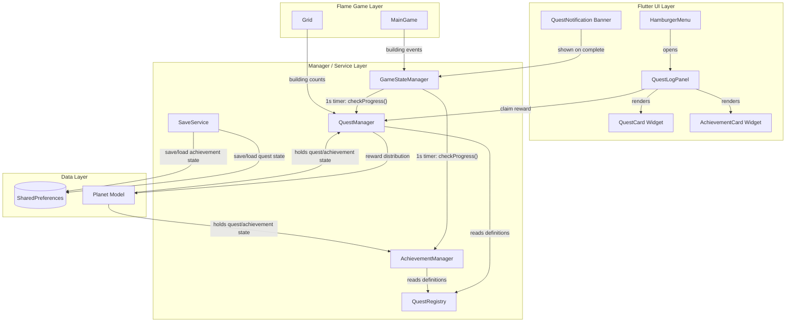
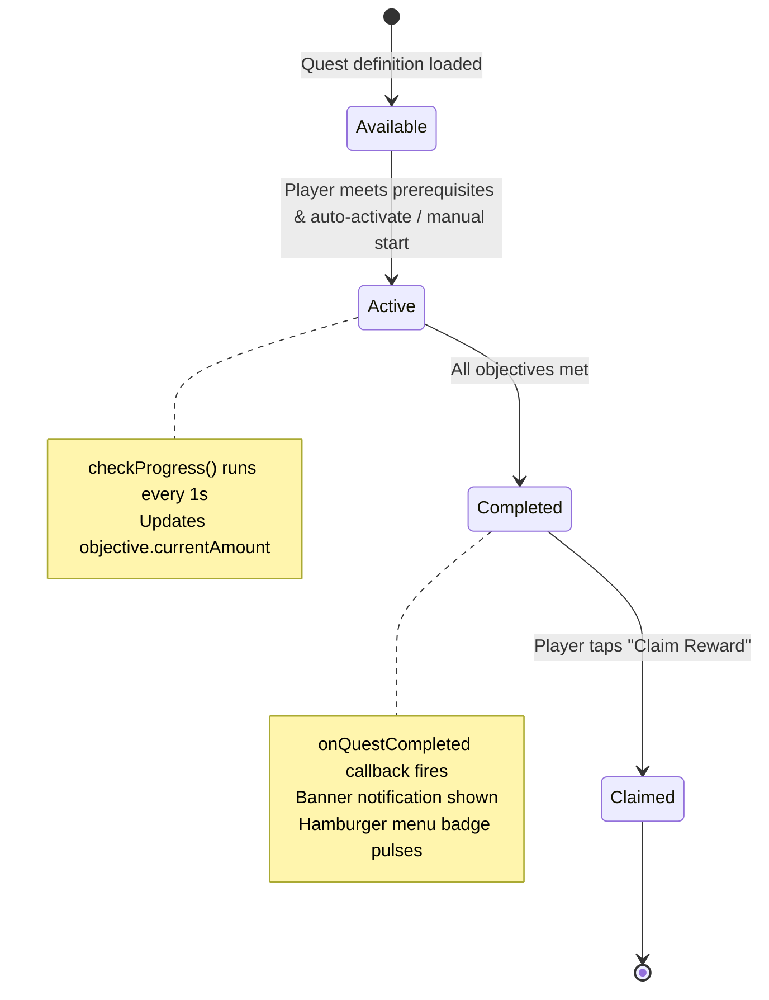

# Quest and Achievement System — Implementation Plan

## Goal

Introduce a quest and achievement system that provides directed short-term objectives (quests) and long-term milestones (achievements) to guide player progression beyond raw resource accumulation. The system will integrate tightly with the existing resource, building, and research subsystems, persist state via `SaveService`/`SharedPreferences`, and be accessible from the hamburger menu. It must support at least 50 concurrent definitions, evaluate each quest within 5 ms, and render the quest log within 200 ms.

## Requirements

### Must Have (P0)

- **FR-QST-001** — `Quest` model with id, name, description, objectives list, reward, prerequisite quest IDs, and status enum (`available | active | completed | claimed`).
- **FR-QST-002** — `QuestManager` that tracks available, active, completed, and claimed quests and exposes methods for activation, progress evaluation, completion, and reward claiming.
- **FR-QST-003** — `QuestObjective` with types: `buildBuilding`, `accumulateResource`, `completeResearch`, `reachPopulation`, `achieveHappiness`, `upgradeBuilding`.
- **FR-QST-004** — Automatic quest completion detection: `QuestManager.checkProgress(...)` called from the 1-second resource timer in `GameStateManager`.
- **FR-QST-005** — Quest log UI panel accessible from the hamburger menu with three tabs: **Active Quests**, **Completed**, **Achievements**.
- **FR-QST-006** — Quest and achievement state persisted via `SaveService` under planet-scoped keys (`planet.<id>.quests`, `planet.<id>.achievements`).
- **QST-CONTENT** — At least 10 starter quests covering early-game mechanics (building, resource accumulation, research).

### Should Have (P1)

- **FR-QST-007** — `Achievement` model and `AchievementManager` for permanent milestones tracked separately from quests (never expire, global progress).
- **FR-QST-008** — Quest chains: completing a quest unlocks follow-up quests via `prerequisiteQuestIds`.
- **FR-QST-009** — Daily/weekly rotating quests with a seed-based procedural generator and expiry timestamps.
- **FR-QST-010** — Toast/banner notification system for quest completion and new quest availability; pulsing badge on hamburger menu icon when unclaimed rewards exist.

### Could Have (P2 — deferred)

- FR-QST-011 — Cosmetic building skin rewards.
- FR-QST-012 — Achievement leaderboards (requires backend).
- FR-QST-013 — Planet-specific biome quests.

### Non-Functional

- **NFR-QST-001** — Quest state check ≤ 5 ms per quest (use O(1) lookups, avoid list scans).
- **NFR-QST-002** — Support ≥ 50 concurrent quest/achievement definitions without performance degradation.
- **NFR-QST-003** — Quest log UI loads within 200 ms (lazy-build tabs, minimal widget rebuilds).

---

## Technical Considerations

### System Architecture Overview



### Technology Stack

| Layer | Technology | Rationale |
|-------|-----------|-----------|
| Data models | Plain Dart classes | Consistent with `Building`, `Research` patterns — no external dependencies |
| State management | Callback bridge (Flame → Flutter) | Matches existing `scene_widget.dart` pattern |
| Persistence | `SharedPreferences` + JSON encode | Matches `SaveService.savePlanet()` pattern |
| UI | Flutter Material widgets | Consistent with existing hamburger menu, resource display |
| Testing | `flutter test` with `SharedPreferences.setMockInitialValues` | Existing test pattern |

### Integration Points

| Touchpoint | Direction | Details |
|-----------|-----------|---------|
| `GameStateManager._resourceTimer` | Manager → QuestManager | Calls `questManager.checkProgress(resources, buildings, researchManager)` every 1 s |
| `SaveService.savePlanet()` / `loadOrCreatePlanet()` | Bidirectional | Serializes/deserializes quest + achievement state alongside planet data |
| `Planet` model | Data holder | Gains `QuestManager` and `AchievementManager` fields |
| `HamburgerMenu` | UI entry point | New "Quests" `ListTile` navigates to `QuestLogPanel` |
| `MainGameWidget` (`scene_widget.dart`) | Orchestrator | Wires `QuestManager` notifications to banner overlay |

---

### Database Schema Design (SharedPreferences JSON)

Since the project uses `SharedPreferences` (not SQLite), data is stored as JSON strings under planet-scoped keys.

**Quest State** — key: `planet.<planetId>.quests`

```json
{
  "active": ["quest_first_house", "quest_power_up"],
  "completed": ["quest_welcome"],
  "claimed": ["quest_welcome"],
  "objectiveProgress": {
    "quest_first_house": { "0": 1 },
    "quest_power_up": { "0": 0, "1": 50 }
  }
}
```

**Achievement State** — key: `planet.<planetId>.achievements`

```json
{
  "unlocked": ["ach_first_building", "ach_population_50"],
  "progress": {
    "ach_builder_10": 7,
    "ach_rich": 5000
  }
}
```

**Rotating Quest Seed** — key: `planet.<planetId>.quests.dailySeed`

```json
{ "seed": 20260227, "generatedAt": "2026-02-27T00:00:00Z" }
```

### Indexing / Performance Strategy

- Quest definitions stored in a `Map<String, Quest>` keyed by quest ID for O(1) lookup.
- Active quest list kept as a small `List<String>` (typically < 10 active quests).
- Objective progress stored as `Map<String, Map<int, int>>` — quest ID → objective index → current value.
- Achievement definitions in `Map<String, Achievement>` for O(1) lookup.
- Building counts cached per tick in `GameStateManager` to avoid repeated grid scans.

---

### API Design (Internal Dart APIs)

#### QuestManager

```pseudocode
class QuestManager {
  Map<String, QuestState> _questStates;  // id → state

  void activateQuest(String questId);
  void checkProgress(Resources res, List<Building> buildings, ResearchManager rm);
  bool claimReward(String questId, Resources resources);
  List<Quest> getAvailableQuests();
  List<Quest> getActiveQuests();
  List<Quest> getCompletedQuests();

  // Serialization
  Map<String, dynamic> toJson();
  void loadFromJson(Map<String, dynamic> json);

  // Notification callback
  void Function(Quest quest)? onQuestCompleted;
  void Function(Quest quest)? onQuestAvailable;
}
```

#### AchievementManager

```pseudocode
class AchievementManager {
  Set<String> _unlockedIds;
  Map<String, int> _progress;

  void checkProgress(Resources res, List<Building> buildings, ResearchManager rm);
  List<Achievement> getAll();  // with unlock status
  
  Map<String, dynamic> toJson();
  void loadFromJson(Map<String, dynamic> json);

  void Function(Achievement)? onAchievementUnlocked;
}
```

#### SaveService Extensions

```pseudocode
// New planet-scoped keys
static String _planetQuestsKey(String planetId) => 'planet.$planetId.quests';
static String _planetAchievementsKey(String planetId) => 'planet.$planetId.achievements';

// Inside _savePlanetInternal:
await prefs.setString(_planetQuestsKey(planetId), jsonEncode(planet.questManager.toJson()));
await prefs.setString(_planetAchievementsKey(planetId), jsonEncode(planet.achievementManager.toJson()));

// Inside loadOrCreatePlanet:
final questJson = prefs.getString(_planetQuestsKey(planetId));
if (questJson != null) questManager.loadFromJson(jsonDecode(questJson));
final achievementJson = prefs.getString(_planetAchievementsKey(planetId));
if (achievementJson != null) achievementManager.loadFromJson(jsonDecode(achievementJson));
```

---

### Frontend Architecture

#### Component Hierarchy

```
Quest Log Page (full-screen page, pushed via Navigator)
├── AppBar
│   ├── Title: "Quest Log"
│   └── Close button
├── TabBar (3 tabs)
│   ├── Tab: "Active" (with count badge)
│   ├── Tab: "Completed"
│   └── Tab: "Achievements"
├── TabBarView
│   ├── Active Quests Tab
│   │   └── ListView.builder
│   │       └── QuestCard (per quest)
│   │           ├── Quest name + description
│   │           ├── Objective list with progress bars
│   │           ├── Reward preview (resource icons + amounts)
│   │           └── "Claim Reward" button (if completed & unclaimed)
│   ├── Completed Quests Tab
│   │   └── ListView.builder
│   │       └── QuestCard (completed state, muted style)
│   └── Achievements Tab
│       └── GridView.builder (3 columns)
│           └── AchievementCard
│               ├── Badge icon (locked/unlocked)
│               ├── Achievement name
│               ├── Progress bar (if trackable)
│               └── Tap → detail overlay
└── QuestNotification Banner (overlay, positioned top-center)
    ├── Quest/Achievement icon
    ├── Completion message
    └── Auto-dismiss after 3s
```

#### State Flow



#### UI Styling (Dark Space Theme)

- Background: `Colors.black.withAlpha(230)` — matches hamburger menu.
- Accent: `Colors.cyanAccent` for active quest highlights, progress bars.
- Completed: `Colors.greenAccent` checkmark overlay.
- Locked achievements: `Colors.grey.withAlpha(128)` with padlock icon.
- Card background: `Colors.white.withAlpha(20)` with cyan border.
- Progress bars: `LinearProgressIndicator` with `cyanAccent` active, `grey[800]` track.
- Notifications: Slide-in from top with `AnimatedPositioned`, auto-dismiss 3 s.

---

### Security & Performance

| Concern | Strategy |
|---------|----------|
| Data validation | `QuestManager.loadFromJson` validates quest IDs against `QuestRegistry`; unknown IDs are logged and skipped (graceful degradation) |
| Save corruption | JSON parse wrapped in try/catch with fallback to empty state (same pattern as `SaveService` building limits) |
| Performance — quest check | O(n) over active quests only (typically < 10), each objective is O(1) lookup via cached building counts and resource map |
| Performance — UI | `ListView.builder` / `GridView.builder` for lazy rendering; tabs built on demand via `AutomaticKeepAliveClientMixin` |
| Memory | Quest definitions are static singletons; only progress state is per-planet |

---

## File System — New Files

```
lib/
  game/
    quests/
      quest.dart                    # Quest, QuestObjective, QuestReward, QuestStatus models
      quest_manager.dart            # QuestManager class — activation, progress, completion, serialization
      quest_objective.dart          # QuestObjectiveType enum and evaluation logic
      quest_registry.dart           # Static registry of all quest definitions (10+ starter quests)
    achievements/
      achievement.dart              # Achievement model and AchievementType enum
      achievement_manager.dart      # AchievementManager — tracking, evaluation, serialization
  widgets/
    game/
      quest_log_panel.dart          # Full-screen quest log page with tabs
      quest_notification.dart       # Banner notification widget for quest/achievement completion
    cards/
      quest_card.dart               # Quest card widget with progress bars and reward preview
      achievement_card.dart         # Achievement badge card (locked/unlocked states)
  pages/
    quest_log_page.dart             # Route wrapper for QuestLogPanel (consistent with existing pages/)

test/
  quests/
    quest_test.dart                 # Unit tests for Quest model
    quest_manager_test.dart         # Unit tests for QuestManager (progress, completion, serialization)
    quest_registry_test.dart        # Validates all quest definitions are well-formed
  achievements/
    achievement_test.dart           # Unit tests for Achievement model
    achievement_manager_test.dart   # Unit tests for AchievementManager
  widgets/
    quest_card_test.dart            # Widget tests for QuestCard
    achievement_card_test.dart      # Widget tests for AchievementCard
```

## File System — Modified Files

| File | Changes |
|------|---------|
| `lib/game/planet/planet.dart` | Add `QuestManager questManager` and `AchievementManager achievementManager` fields; update constructor, `copyWith` |
| `lib/game/services/save_service.dart` | Add planet-scoped quest/achievement keys; serialize in `_savePlanetInternal`; deserialize in `loadOrCreatePlanet` |
| `lib/game/managers/game_state_manager.dart` | Add `QuestManager` and `AchievementManager` fields; call `checkProgress()` in the 1-second timer callback |
| `lib/widgets/game/hamburger_menu.dart` | Add "Quests" `ListTile` with icon; pass `QuestManager`/`AchievementManager` props; show badge when unclaimed rewards |
| `lib/game/scene_widget.dart` | Wire `QuestManager` from planet into `GameStateManager`; handle quest notification overlay state; pass managers to `HamburgerMenu` |

---

## Implementation Phases

### Phase 1 — Data Models & Core Logic

1. **Quest objective types** — Create `lib/game/quests/quest_objective.dart` with `QuestObjectiveType` enum and `QuestObjective` class.
2. **Quest model** — Create `lib/game/quests/quest.dart` with `Quest`, `QuestReward`, `QuestStatus`.
3. **Quest manager** — Create `lib/game/quests/quest_manager.dart` with activation, progress checking, completion, reward claiming, and JSON serialization.
4. **Quest registry** — Create `lib/game/quests/quest_registry.dart` with 10+ starter quest definitions.
5. **Achievement model** — Create `lib/game/achievements/achievement.dart`.
6. **Achievement manager** — Create `lib/game/achievements/achievement_manager.dart`.
7. **Unit tests** — Tests for all models and managers.

### Phase 2 — Persistence & Integration

8. **Planet model update** — Add `QuestManager` and `AchievementManager` to `Planet`.
9. **SaveService update** — Add quest/achievement serialization in `savePlanet` and `loadOrCreatePlanet`.
10. **GameStateManager update** — Instantiate quest/achievement managers; call `checkProgress()` in the resource timer.
11. **SceneWidget wiring** — Sync quest managers from planet on load; handle notification state.
12. **Integration tests** — Save/load round-trip tests.

### Phase 3 — UI

13. **QuestCard widget** — Card showing quest name, objectives with progress bars, rewards preview, claim button.
14. **AchievementCard widget** — Badge card with locked/unlocked states and progress.
15. **QuestLogPage** — Full-screen page with TabBar (Active/Completed/Achievements) and lazy-built lists.
16. **HamburgerMenu update** — Add "Quests" entry with notification badge.
17. **Quest notification banner** — Slide-in banner overlay for quest completion events.
18. **Widget tests** — Tests for quest card, achievement card, and quest log page.

### Phase 4 — Polish & Extended Features

19. **Quest chains** — Prerequisite unlocking logic with cascading availability checks.
20. **Daily/weekly quests** — Seed-based procedural quest generation with expiry tracking.
21. **Notification badge** — Pulsing indicator on hamburger menu icon when unclaimed rewards exist.
22. **Performance validation** — Profile quest check loop, ensure ≤ 5 ms per quest, UI load ≤ 200 ms.

---

## Starter Quest Definitions (10 Quests)

| ID | Name | Objectives | Reward |
|----|------|-----------|--------|
| `quest_welcome` | Welcome to Horologium | Build 1 House | 200 cash |
| `quest_power_up` | Power Up | Build 1 Power Plant, Complete Electricity research | 300 cash, 50 coal |
| `quest_gold_rush` | Gold Rush | Build 1 Gold Mine, Accumulate 100 gold | 500 cash |
| `quest_lumber_yard` | Lumber Yard | Build 2 Wood Factories | 200 wood |
| `quest_growing_town` | Growing Town | Reach population 50 | 500 cash, 100 wood |
| `quest_researcher` | Knowledge Seeker | Complete 3 research projects | 1000 cash |
| `quest_grain_master` | Grain Master | Build 1 Wind Mill, Build 1 Grinder Mill | 300 cash, 50 wheat |
| `quest_water_works` | Water Works | Build 2 Water Treatment plants | 200 cash, 100 water |
| `quest_industrialist` | Industrialist | Build 1 of each: House, Power Plant, Gold Mine, Wood Factory | 1000 cash |
| `quest_happy_town` | Happy Citizens | Achieve happiness ≥ 70 | 500 cash, 200 gold |

## Starter Achievement Definitions (8 Achievements)

| ID | Name | Condition | 
|----|------|-----------|
| `ach_first_building` | Foundation | Place your first building |
| `ach_builder_10` | Builder | Place 10 buildings |
| `ach_builder_50` | Architect | Place 50 buildings |
| `ach_population_50` | Small Town | Reach 50 population |
| `ach_population_200` | City | Reach 200 population |
| `ach_rich` | Wealthy | Accumulate 10,000 cash |
| `ach_all_research` | Scholar | Complete all research |
| `ach_happiness_90` | Utopia | Achieve 90+ happiness |
